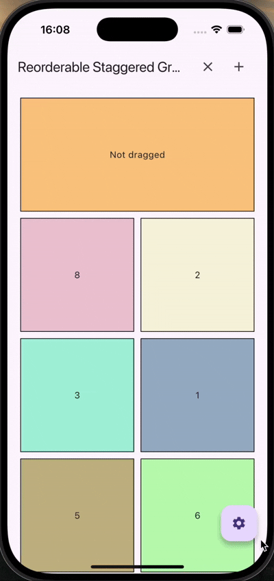

# reorderable_staggered_grid_view

<!-- [](https://pub.dartlang.org/packages/reorderable_staggered_scroll_view) [](https://github.com/itisnajim/reorderable_staggered_scroll_view/blob/master/LICENSE)  [](https://github.com/itisnajim/reorderable_staggered_scroll_view/issues) -->

A Flutter package for creating reorderable and draggable staggered grid views. This package provides an intuitive way to build a grid with the ability to change the order, and also supports lazy element construction, which allows it to be used for a large number of complex elements without loss of performance. 

| Reordering | Not dragged |
| :---: | :---: | 
| |  |

## Features

* Reorder items with ease using drag and drop gestures
* Lazy construction of grid elements
* Configurable drag-and-drop behavior
* The APIs provided by the library provide great opportunities for customization and customization of the appearance and interactive features of the grid (animations, feedback widget, etc.)

| Adding/deleting | Actions |
| :---: | :---: | 
|  |  |

## Getting Started

To use this package, add it to your pubspec.yaml file:

```yaml
dependencies:
  reorderable_staggered_grid_view: ^latest_version
```
Replace ^latest_version with the actual version you want to use.

Import the package in your Dart code:

```dart
import 'package:reorderable_staggered_grid_view/reorderable_staggered_grid_view.dart';
```

## Usage

The developer has two classes available - ```ReorderableStaggeredGridView``` and ```ReorderableStaggeredGridViewItem```. Both classes have a large number of parameters for customizing scrolling, animations, sizes, and so on.

### Create items

Generate ```List<ReorderableStaggeredGridViewItem>```.

```dart
/// Items
static final List<ReorderableStaggeredGridViewItem> items = List.generate(
    10,
    _generateItem,
);

static ReorderableStaggeredGridViewItem _generateItem(int index) {
    final key = widgetKeyById(index);
    final animationKey = animationKeyById(index);

    return ReorderableStaggeredGridViewItem(
            animationKey: animationKey,
            data: index,
            mainAxisCellCount: Random().nextInt(2) + 1,
            crossAxisCellCount: Random().nextInt(2) + 1,
            child: TileWidget(
            key: key,
            title: Text(index == 0 ? 'Not dragged' : index.toString()),
            color: Color.fromRGBO(
                Random().nextInt(255),
                Random().nextInt(255),
                Random().nextInt(255),
                0.5,
            ),
        ),
    );
}
```

### Build grid

To create the grid, the standard constructor ```ReorderableStaggeredGridView()``` is used, to which an array of elements ```List<ReorderableStaggeredGridViewItem>``` is passed. By default, this grid layout already supports lazy drawing of elements.

```dart
return ReorderableStaggeredGridView(
    padding: EdgeInsets.all(20),
    enable: enableDragging,
    crossAxisCount: Constants.calculateCrossAxisCount(
        constraints.maxWidth,
    ),
    mainAxisSpacing: Constants.spacing,
    crossAxisSpacing: Constants.spacing,
    isLongPressDraggable: enableLongPress,
    nonDraggableWidgetsKeys: [Constants._widgetKeys[0]!],
    items: items,
);
```

### Saving states

To preserve the internal state of the elements, it is recommended to assign them to the GlobalKey widgets. In this case, when dragging or changing the network mode, you ensure that you do not lose the internal states of the elements.

```dart
static final Map<int, GlobalKey> _widgetKeys = {};
static GlobalKey widgetKeyById(int id) => _widgetKeys.putIfAbsent(
    id,
    () => GlobalKey(),
);
```

Check the example to see all the subtleties of the package implementation that was originally conceived.

## Future

The following functions are planned to be implemented:

* Shifting grid items without releasing the dragged widget
* Creating grid constructors for lazy and non-lazy buildings of elements

## Contributing

We welcome contributions! If you have ideas for improvements or encounter issues, please open an issue or submit a pull request.

## Author

lgusev, rastrast207@gmail.com

## License
This package is licensed under the MIT License. See the LICENSE file for more details.